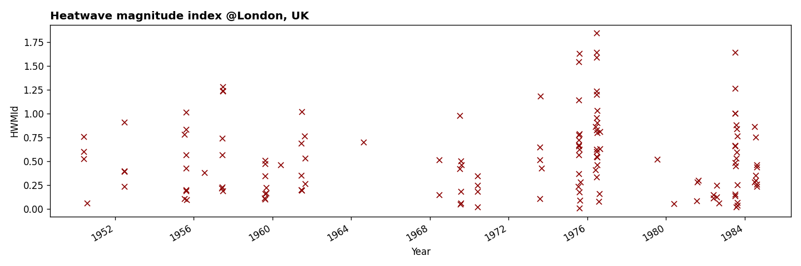

# Heatwave magnitude index daily (HWMId)

This is an ``xarray`` wrapper to compute the heatwave magnitude index daily (HWMId) as defined in [Russo et al. (2015)](https://iopscience.iop.org/article/10.1088/1748-9326/10/12/124003/meta#erl521519s) in Python.

**Reference**: Simone Russo et al 2015 Environ. Res. Lett. 10 124003

## Usage

As an example, load **daily maximum temperature** for London, UK:

```py
import xarray as xr

t2m_max = xr.open_dataarray('data/london_t2m_max.nc')
```


Compute the HWMId defining a heatwave as being above the 90th quantile and occuring over at least 3 days. The index is computed against a reference period which we define here between 1950 and 1979. The reference quantiles are calculated using a centered 31-day window for a given day of the year:

```py
from hwmid import HWMId

hwmid = HWMId(
    t2m_max,
    quantile=.9,
    n_days=3,
    win_size=31,
    ref_period=slice('1950', '1979')
)
```



Calculate the yearly magnitude:

```py
magnitude = hwmid.groupby('time.year').sum()
```


