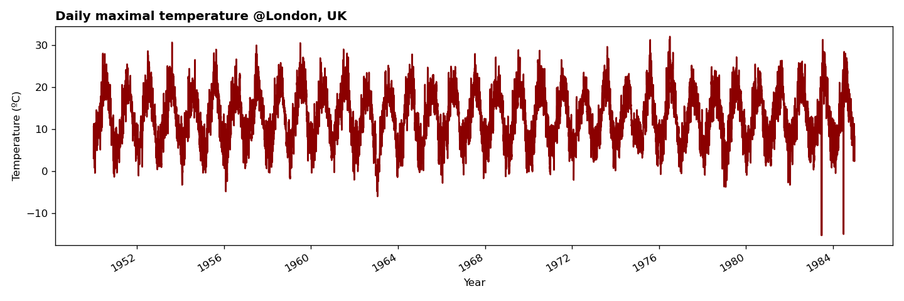

# Heatwave magnitude index daily (HWMId)

This is an ``xarray`` wrapper to compute the heatwave magnitude index daily (HWMId) as defined in [Russo et al. (2015)](https://iopscience.iop.org/article/10.1088/1748-9326/10/12/124003/meta#erl521519s) in Python.

**Reference**: Simone Russo et al 2015 Environ. Res. Lett. 10 124003

## Installation
To make the code locally available you first need to clone this repository
```
git clone https://github.com/nicrie/HWMId.git
```
Within the newly created directory you can import the code as shown below. To enable import in files outsides of the directory, you may want to add the directory to your Python path.

## Usage

As an example, load **daily maximum temperature** for London, UK:

```py
import xarray as xr

t2m_max = xr.open_dataarray('data/london_t2m_max.nc')
```



Compute the daily magnitude $M_d$ of a heatwave. Here, a heatwave is defined as a daily maximum temperature above the 90th quantile over at least 3 consecutive days. The index is computed against a reference period which we define here between 1950 and 1979. The reference quantiles are calculated using a centered 31-day window for a given day of the year:

```py
from hwmid import Md

daily_magnitude = Md(
    t2m_max,
    quantile=.9,
    n_days=3,
    win_size=31,
    ref_period=slice('1950', '1979')
)
```
The figure below shows the daily magnitudes $M_d$ for all heatwaves between 1950 and 1985.


Compute the heatwave magnitudes as the sum over consecutive heatwave days:

```py
eps = 1e-5  # to represent zero
heatwave_magnitude = daily_magnitudes.groupby((daily_magnitudes < eps).cumsum('time')).cumsum()
```


Finally, compute the HWMId as the maximum heatwave magnitude per year:

```py
HWMId = heatwave_magnitude.groupby('time.year').max()
```


## Credits
*2022/10/17 Thanks to Julian Krüger for indicating some inconsistenty in the definitions. Should be fixed now :) 